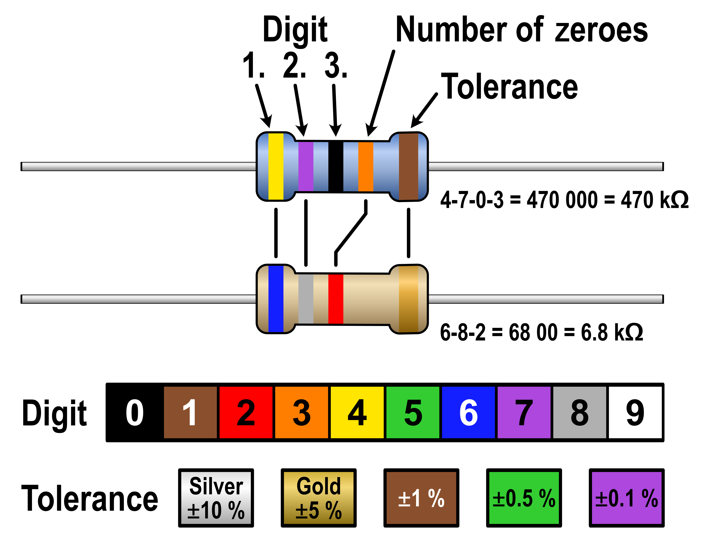
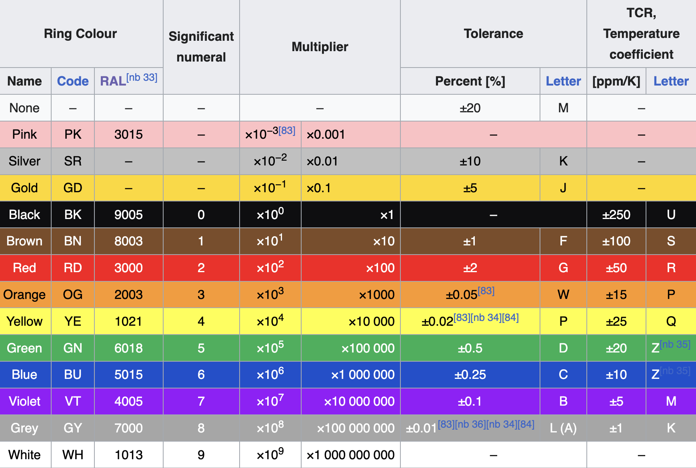

# Resistors
---
## Standard Resistor
Resistors are compenents that restrict current flow based on it's internal resistivity defined by $$\rho = \frac{R \cdot A}{L}$$ (Though if based on temperature it becomes $\rho(T) = \rho_0[1+\alpha(T-T_0)]$ Where $\rho_0$ is the resistivity at reference temperature, $T_0,T$ is the current temperature, and $\alpha$ is the temperature coefficient of resistivity.) Their primary uses are in current-limiting, voltage dividing, and pull-up/pull-down configurations.
There are three main electrical symbols for the resistor (ANSI-Style) as shown in the figure below. 'A' represents the standard resistor, 'B' represents a rhetrostat (two-terminal high-wattage device in-series), and 'C' represents a potentiometer (three-terminal low-wattage device in-parallel)

## Theory
Primarily thought of and analyzed using three primary aspects
* ohm's law $V=IR$ (you know this).
* Resistors in-series add their respective values
  * $R_{eq}=\sum_{i=1}^n R_i$
* Resistors in-parallel total value is the reciprocal of the sum of the reciprocals of the individual resistors.
  * $R_{eq}=(\sum^n_{i=1} \frac{1}{R_i})^{-1}$

#### Power Dissipation
Resistors for power senistive circuits are primarily evaluated based on their power dissipation, or how much power a resistor can have dissipated across it. $$P=\frac{V^2}{R}=I^2R=VI$$
The primary values are $\frac{1}{10},\frac{1}{8},\text{or } \frac{1}{4}$, but some are highly variable. If a resistor exceeds it's dissipation rating then it then there may be damage to the resistor resulting in a permanant change in resistance. Note that so long as the resistor stays within it's temperature coefficient, it is likely reversible.

#### Non-Ideal Properties
All resistors have some trace parasitic inductance (in-series) and capacitance (parallel across resistor). This can cause issues at high frequency, especially in senarios where the resistor is operating close to it's temperature coefficient.

## Fixed Resistors
There are many different types of materials used when considering resistors. What is included below is the most common.
| Resistor Type | Construction / Technology | Typical Characteristics | Development / When to Use |
|---|---|---|---|
| Carbon Composition | Carbon + ceramic mixture | Poor stability, relatively high noise, non-inductive, good overload capability | Legacy/vintage designs, high-energy pulses, surge protection |
| Carbon Film | Carbon film deposited on ceramic substrate | Low cost, relatively low noise, moderate power and voltage ratings | General-purpose applications when precision is not critical |
| Thick Film | Conductive ceramic/glass film printed onto substrate | Low cost, typically 1–5% tolerance, relatively high TCR | Default choice for most general-purpose PCB resistors |
| Thin Film | Precision resistive film deposited on ceramic substrate | High precision, low noise, low TCR, good stability | Precision analog, sensing, feedback, ADC/DAC networks |
| Metal Film | Metal film, commonly NiCr, on insulating substrate | Good stability, low noise, typically 0.5–2% tolerance, low TCR | General-purpose precision, analog circuits, voltage dividers |
| Metal Oxide Film | Metal-oxide resistive film | High temperature capability, good stability and reliability | High-temperature or high-endurance applications |
| Wirewound | Metal resistance wire wound around a core | Very high power capability, high temperature capability, potentially inductive | Power resistors, braking, loads, current limiting; avoid high-frequency applications |
| Metal Foil | Precision metal-alloy foil on substrate | Extremely high precision and stability, extremely low TCR | Precision instrumentation, reference circuits, precision measurement |
| Ammeter Shunt | Low-resistance metal/alloy element | Very low resistance, designed for accurate current measurement | Current sensing / measuring high currents |
| Grid Resistor | Large metal-alloy strips arranged in a grid | Extremely high power and current capability | Industrial/high-power systems, braking, load banks, grounding, generator testing |
| Carbon Pile | Stack of carbon disks with adjustable compression | Resistance changes with mechanical pressure; adjustable load | Variable high-power loads, battery/load testing, specialized applications |
| Printed Carbon | Carbon resistor printed directly onto PCB | Very low cost, large tolerance (often ~30%) | Non-critical PCB functions such as pull-ups or low-cost disposable designs |

## RF and High Frequency Behavior
At lower frequencies the primary concerns of resistors are power-dissipation, size, value, and heat. However at high frequencies the actual impedance of the resistance needs to be analyzed.
A resistor's relative impedance is determined by the operational frequency and it's self-resonant frequenc $f_0=\frac{1}{2\pi \sqrt{L_{res} C_{res}}}$. Where below this value it appears inductive, and above this value it is capacitive. This results in a total impedance of $Z=R+j\omega L-j\frac{1}{\omega C}$
Additionally at high frequencies the skin-affect (the trend of electrons attempting to move along the conductor's surface and not interior) will take affect.
The primary factors are:
* Physical Dimensions
* Properties of resistive material
* Connecting Wires
Use RF-rated resistors in these circumstances.

## Color Code

When actually using resistors and testing with certain tolerances, we can identify it by their corresponding 4th stripe found on any through-hole resistor. Utilize the table below to determine them.

## Tolerances
The actual value of the resistor might might exactly be what is adverized to a few decimal spaces. In respect to this we use **E-series** markings (IEC 60063). These are logmarithically scalled steps divided into 3, 6, 12, 24, 48, 96, and 192 that correspond to their % tolerance. The mathematical formula is as follows
$$V_n = \mathrm{round} (\sqrt[m]{10^n})$$
$𝑉_n$ is rounded to 2 (E3, E6, E12, E24) or 3 (E48, E96, E192) significant figures,
$m$ is an integer of  {3,6,12,24,48,96,192},
$n$ is an integer of {0,1,...,𝑚−1}.
$\textit{*Note: Some actual tolerance values used are not 1-1 with this equation as}$
$\textit{the usefulness of some values are shifted to meet the needs of industry}$

Here is the table of codes:
| E-Series | Tolerance | Standard Values |
|:---:|:---:|:---|
| **E3** | ±40% | 1.0, 2.2, 4.7 |
| **E6** | ±20% | 1.0, 1.5, 2.2, 3.3, 4.7, 6.8 |
| **E12** | ±10% | 1.0, 1.2, 1.5, 1.8, 2.2, 2.7, 3.3, 3.9, 4.7, 5.6, 6.8, 8.2 |
| **E24** | ±5% | 1.0, 1.1, 1.2, 1.3, 1.5, 1.6, 1.8, 2.0, 2.2, 2.4, 2.7, 3.0, 3.3, 3.6, 3.9, 4.3, 4.7, 5.1, 5.6, 6.2, 6.8, 7.5, 8.2, 9.1 |
| **E48** | ±2% | 1.00, 1.05, 1.10, 1.15, 1.21, 1.27, 1.33, 1.40, 1.47, 1.54, 1.62, 1.69, 1.78, 1.87, 1.96, 2.05, 2.15, 2.26, 2.37, 2.49, 2.61, 2.74, 2.87, 3.01, 3.16, 3.32, 3.48, 3.65, 3.83, 4.02, 4.22, 4.42, 4.64, 4.87, 5.11, 5.36, 5.62, 5.90, 6.19, 6.49, 6.81, 7.15, 7.50, 7.87, 8.25, 8.66, 9.09, 9.53 |
| **E96** | ±1% | 1.00, 1.02, 1.05, 1.07, 1.10, 1.13, 1.15, 1.18, 1.21, 1.24, 1.27, 1.30, 1.33, 1.37, 1.40, 1.43, 1.47, 1.50, 1.54, 1.58, 1.62, 1.65, 1.69, 1.74, 1.78, 1.82, 1.87, 1.91, 1.96, 2.00, 2.05, 2.10, 2.15, 2.21, 2.26, 2.32, 2.37, 2.43, 2.49, 2.55, 2.61, 2.67, 2.74, 2.80, 2.87, 2.94, 3.01, 3.09, 3.16, 3.24, 3.32, 3.40, 3.48, 3.57, 3.65, 3.74, 3.83, 3.92, 4.02, 4.12, 4.22, 4.32, 4.42, 4.53, 4.64, 4.75, 4.87, 4.99, 5.11, 5.23, 5.36, 5.49, 5.62, 5.76, 5.90, 6.04, 6.19, 6.34, 6.49, 6.65, 6.81, 6.98, 7.15, 7.32, 7.50, 7.68, 7.87, 8.06, 8.25, 8.45, 8.66, 8.87, 9.09, 9.31, 9.53, 9.76 |
| **E192** | ±0.5% and lower | 1.00, 1.01, 1.02, 1.04, 1.05, 1.06, 1.07, 1.09, 1.10, 1.11, 1.13, 1.14, 1.15, 1.17, 1.18, 1.20, 1.21, 1.23, 1.24, 1.26, 1.27, 1.29, 1.30, 1.32, 1.33, 1.35, 1.37, 1.38, 1.40, 1.42, 1.43, 1.45, 1.47, 1.49, 1.50, 1.52, 1.54, 1.56, 1.58, 1.60, 1.62, 1.64, 1.65, 1.67, 1.69, 1.72, 1.74, 1.76, 1.78, 1.80, 1.82, 1.84, 1.87, 1.89, 1.91, 1.93, 1.96, 1.98, 2.00, 2.03, 2.05, 2.08, 2.10, 2.13, 2.15, 2.18, 2.21, 2.23, 2.26, 2.29, 2.32, 2.34, 2.37, 2.40, 2.43, 2.46, 2.49, 2.52, 2.55, 2.58, 2.61, 2.64, 2.67, 2.71, 2.74, 2.77, 2.80, 2.84, 2.87, 2.91, 2.94, 2.98, 3.01, 3.05, 3.09, 3.12, 3.16, 3.20, 3.24, 3.28, 3.32, 3.36, 3.40, 3.44, 3.48, 3.52, 3.57, 3.61, 3.65, 3.70, 3.74, 3.79, 3.83, 3.88, 3.92, 3.97, 4.02, 4.07, 4.12, 4.17, 4.22, 4.27, 4.32, 4.37, 4.42, 4.48, 4.53, 4.59, 4.64, 4.70, 4.75, 4.81, 4.87, 4.93, 4.99, 5.05, 5.11, 5.17, 5.23, 5.30, 5.36, 5.42, 5.49, 5.56, 5.62, 5.69, 5.76, 5.83, 5.90, 5.97, 6.04, 6.12, 6.19, 6.26, 6.34, 6.42, 6.49, 6.57, 6.65, 6.73, 6.81, 6.90, 6.98, 7.06, 7.15, 7.23, 7.32, 7.41, 7.50, 7.59, 7.68, 7.77, 7.87, 7.96, 8.06, 8.16, 8.25, 8.35, 8.45, 8.56, 8.66, 8.76, 8.87, 8.98, 9.09, 9.20, 9.31, 9.42, 9.53, 9.65, 9.76, 9.88 |

When selecting standard resistor values, first determine the desired nominal resistance and required tolerance. The appropriate **E-series** is then selected based on the required tolerance.
For example, if we require approximately $820\,\text{k}\Omega$ with a $\pm 2\%$ tolerance, we use the **E48 series**. The E48 preferred value closest to $8.20$ is $8.25$.
Since E-series values scale by decades:
$$8.25 \times 100\,\text{k}\Omega = 825\,\text{k}\Omega$$ Therefore, the standard available value is $825\,\text{k}\Omega \pm 2\%$.
