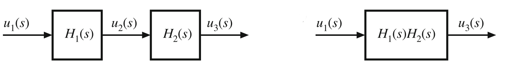
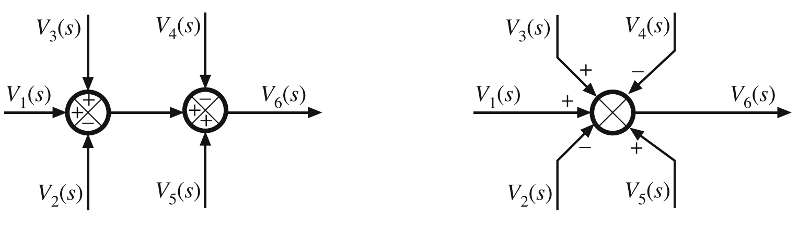
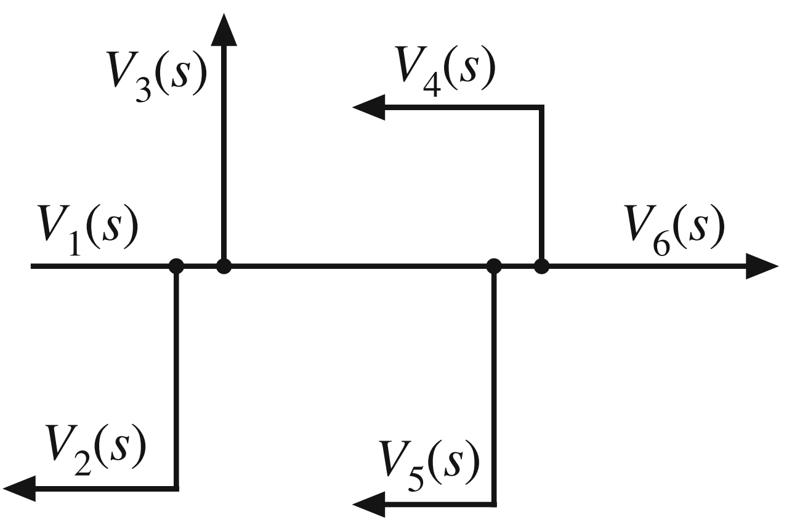
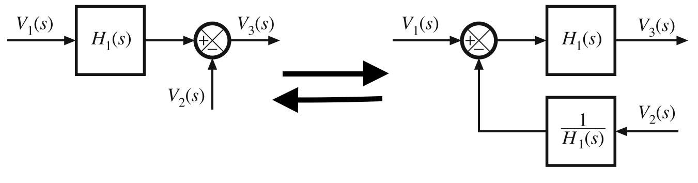
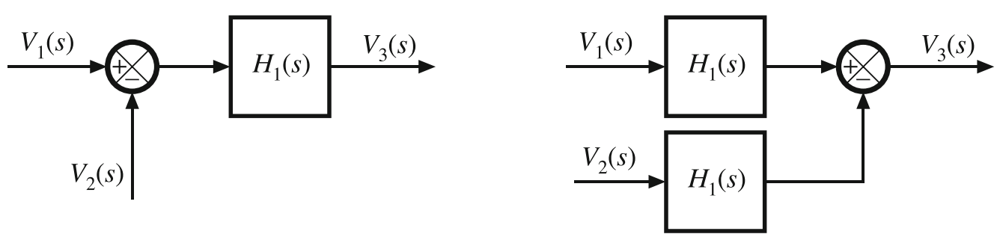
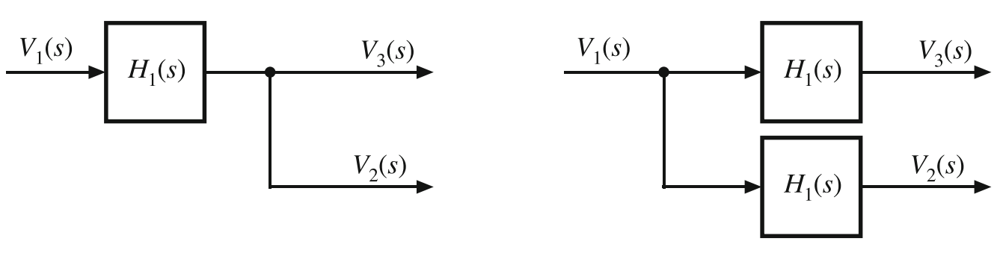
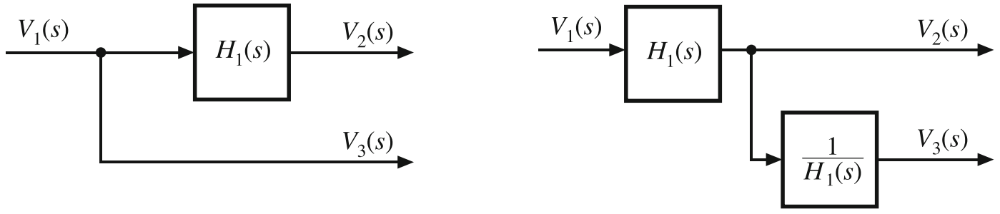
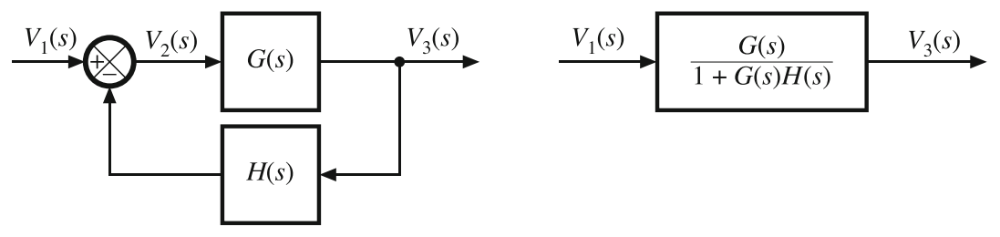
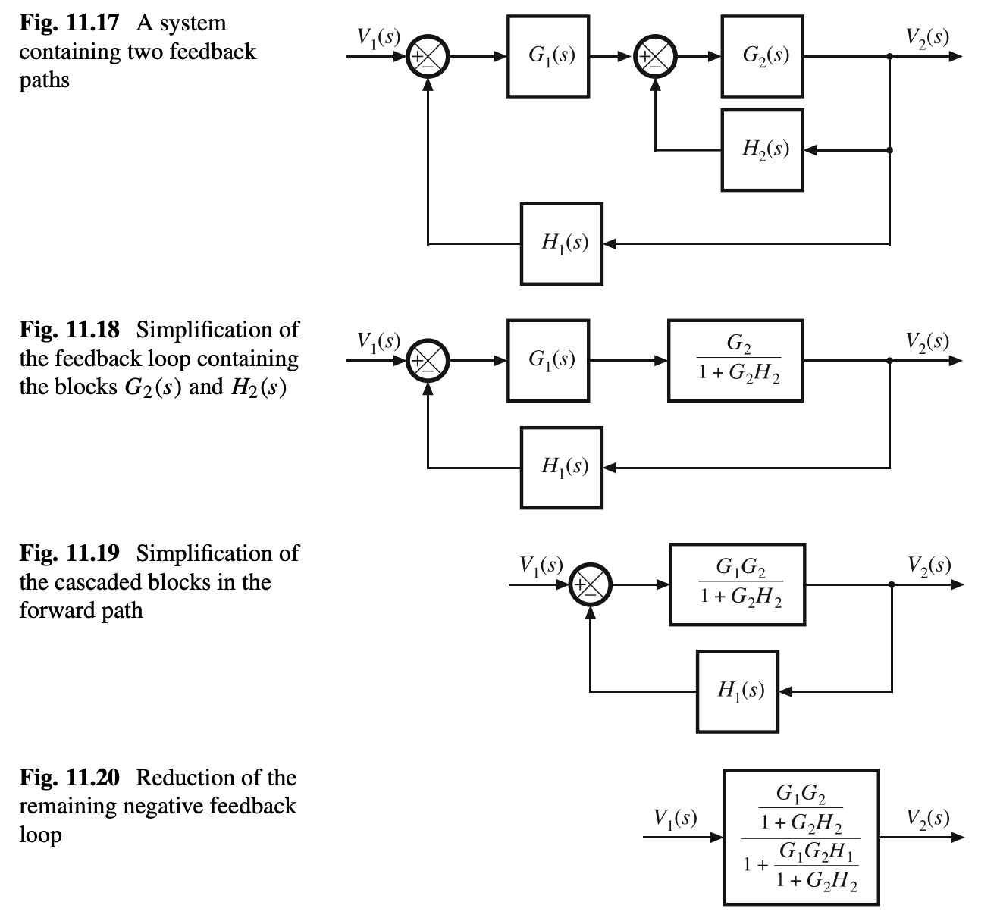

# Chapter 11
## Block Diagrams
---
Method of defining a system using basic functional blocks based on their respective transfer function $H(s)=\frac{u_{out}(s)}{u_{in}(s)}$. Used to determine how multiple circuits/systems work together in an easy to read method. They can be simplified utilizing a few separate techniques.
- ##### Cascade Blocks: 2 blocks in series are equivalent to the product of their two transfer functions
  

  -   Block 1: $u_2(s)=H_1(s)u_1(s)$
  -   Block 2: $u_3(s)=H_2(s)u_2(s)$
  -   Combined: $u_3(s)=H_1(s)H_2(s)u_1(s)$
- ##### Combining Summing Nodes: Algebraic summing of multiple blocks. (+) indicated positive input, (-) indicates negative input and their sum determines the output value.
  

  -    Node 1: $V_1(s)-V_2(s)+V_3(s) = V_{N1}(s)$
  -    Node 2: $V_{N1}(s)-V_4(s)+V_5(s) = V_6(s)$
  -    Combined: $V_1(s)-V_2(s)+V_3(s)-V_4(s)+V_5(s) = V_6(s)$
- ##### Pickoff Points: Section where same signal is routed to different places all with the same function $V(s)$
  
- ##### Pushing Blocks Through Summing Nodes: Ability to push a block before or after a summing node.
  - ###### Forward: A block can be pushed through a summing node, given that it has connected negative feedback with the inverse of the origional block transfer function (i.e. $\frac{1}{H(s)}$)
    

    - Summing Node Un-Pushed: $V_3(s)=V_1(s)H_1(s)-V_2(s)$
    - Summing Node Pushed: $V_3(s)=H_1(s)[V_1(s)-V_2(s)\frac{1}{H_1(s)}]$
    - Equivalency: $H_1(s)[V_1(s)-V_2(s)\frac{1}{H_1(s)}]=H_1(s)V_1(s)-V_2[H_1(s) \times \frac{1}{H_1(s)} = V_1(s)H_1(s)-V_2(s)$
  - ###### Backward: A block can also be backed back through a summing node by having the voltages entering the summing node passed through the transfer function prior.
  

    - Summing Node Un-Pushed: $[V_1(s)-V_2(s)]H_1(s)=V_3(s)$
    - Summing Node Pushed: $V_1(s)H_1(s)-V_2(s)H_1(s)=V_3(s)$
    - Equivalency: $V_1(s)H_1(s)-V_2(s)H_1(s)=H_1(s)[V_1(s)-V_2(s)]H_1(s)=V_3(s)$
- ##### Pushing Blocks Through Pickoff Points: Ability to push transfer function blocks forward and backward through pickoff points.
  - ###### Forward: Take the original transfer function, and multiply the signals after the pickoff point.
    

    - Summing Node Un-Pushed: $V_1(s)H_1(s)=V_2(s)=V_3(s)$
    - Summing Node Pushed: $V_1(s)=H_1(s)V_3(s)=H_1(s)V_2(s)$
  - ###### Backward: Push the block to before the pickoff point, and multiply the other routed signal by the inverse of the transfer function.
  

    - Summing Node Un-Pushed: $V_1(s)=V_3(s)=V_2(s)H_1(s)$
    - Summing Node Pushed: $V_1(s)H_1(s)=V_2(s),V_3(s)=V_1(s)H_1(s)\frac{1}{H_1(s)}=V_1(s)$
- ##### Feedback Connection: Simplification of a positive or negative feedback system (A system whose input is modified by its output through an error signal). Take system transfer function G(s) and it's feedback function H(s) such that it's initial expression $V_3(s)=G(s)V_2(s)$, where $V_2(s)=V_1(s)\pm H(s)V_3(s)$ ('+' for positive feedback, '-' for negative feedback). Then use algebra to incorperate the $V_2(s)$ resulting in:
$$V_3(s)=V_1(s)\frac{G(s)}{1 \pm G(s)H(s)}$$
`Where '+' indicates negative feedback, and '-' indicates positive feedback`

---
### Erickson Example

We can further simplify it into a negative feedback for since Fig. 11.19 shows feedback topology.
$$\frac{V_2(s)}{V_1(s)}=\frac{(\frac{G_1 G_2}{1+G_2 H_2})}{(1+ \frac{G_1 G_2 H_1}{1+ G_2 H_2})}=\frac{G_1 G_2}{1+G_2 H_2 + G_1 G_2 H_1}$$