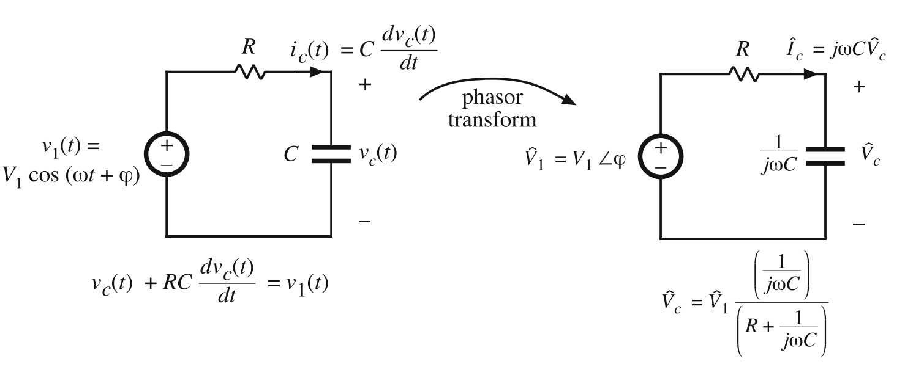
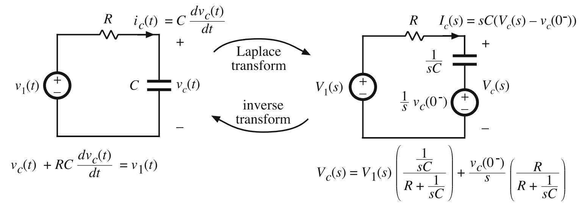
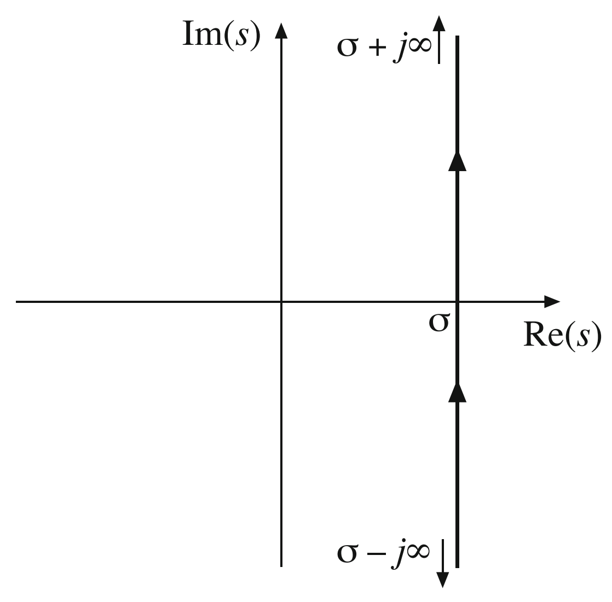
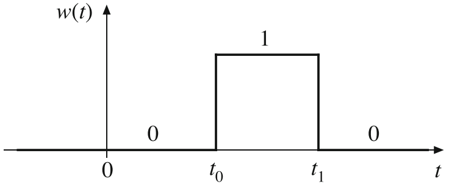
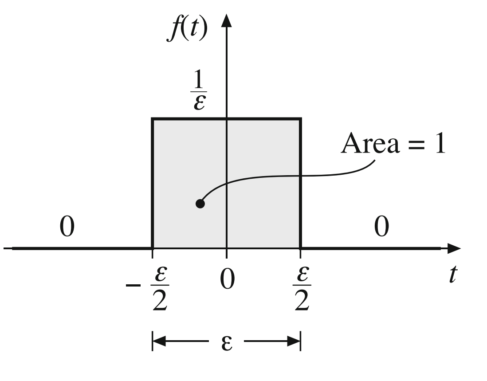
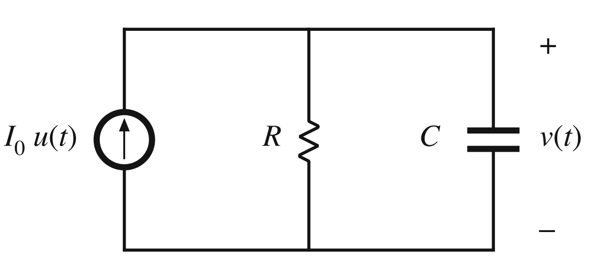
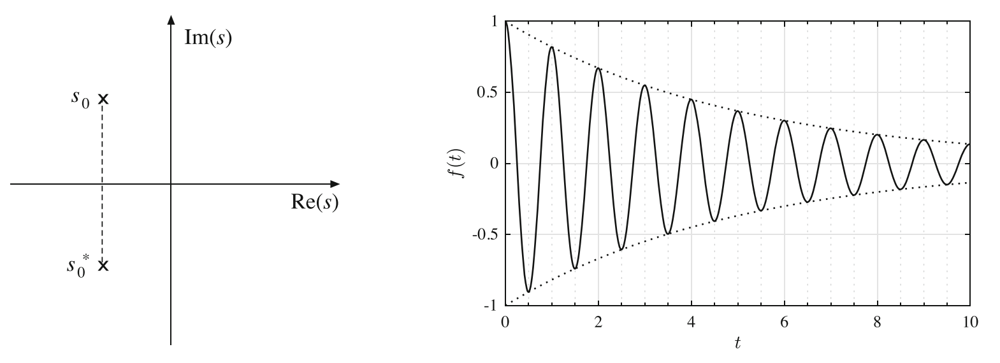
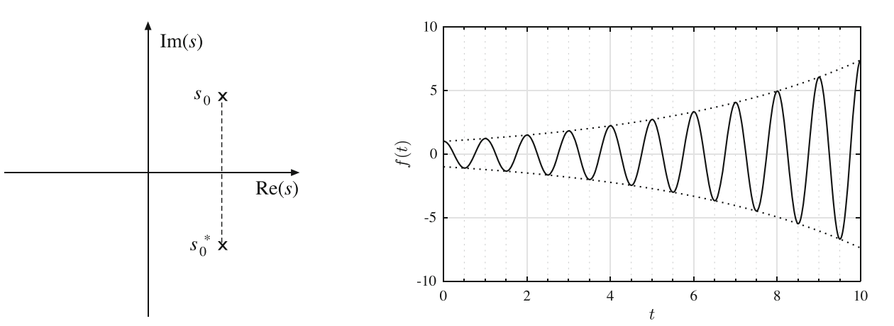
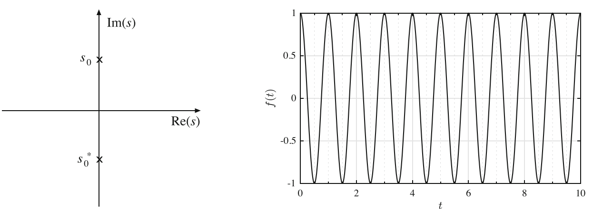

# Chapter 2
## Laplace Transforms
---
Process of converting difficult calculus problems into an algebraic equivalent. Primarily for AC systems through a phasor transformation that can be expressed as:
$$v_1(t)=\Reals (\bar{V_1}(j\omega)e^{j \omega t})$$


For these systems $\bar{V_1}(j \omega)$ is the phasor representation of the sinusoidal input's steady state $v_1(t)=V_1 cos(\omega t + \phi$.

Laplace is similar to phasor, but much broader in terms of waveform analysis. Focuses on transforming linear differential equations of time into algebraic functions of complex frequency `s`.

They differ from phasors due to:
- '$j\omega$' us replaced with 's'
- Initial conditions are represented as independent sources
- Need to find Laplace equivalent for input waveform
- To solve for time, inverse laplace is needed

$$\mathscr{L}(v_1(t))=V_1(s) \rArr v_1(t)=\mathscr{L}^{-1}(V_1(s))$$

### Transform functions
Laplace transform from time domain to s-domain.
$$F(s)=\mathscr{L}(f(t))=\int^{\infty}_{0^-} f(t)e^{-st}dt$$
- Only integrated for positive and zero values of t
- $f(t)$ remains real while $F(s)$ is complex
-
Inverse Laplace Transform from s-domain to time domain
$$f(t)=\mathscr{L}^{-1}(F(s))=\frac{1}{2\pi J} \int^{\sigma +j \infty}_{\sigma -j\infty} F(s)e^{st}ds$$
- $\sigma$: a positive real quantity chosen to enforce convergence, delineate region of convergence to pole locations, anchors integration contour for inversion, and links to growth/decay and stability properties in signals and systems.
- $s=\sigma +j \omega$ with $-\infty < \omega < + \infty$


### Step Functions
Functions allowing a step or value based on the time bounds
$$ u(t) = \begin{cases}
      0, & t < 0 \\
      1, & t > 0
   \end{cases} $$

Step function from Graph: Take Window function as shown below

Also represented as:
$$ w(t) = \begin{cases}
        0, & t < t_0 \\
        1, & t_0 < t < t_1 \\
        0, & t > t_1
    \end{cases} $$
or can be represented in-line as $w(t)=u(t-t_0)-u(t-t_1)$


### Impulse Function
Defined by the following properties:
- $\delta (t)=0 \text{ for } t \neq 0$
- $\int^{+a}_{-a} \delta (t) dt=1 \text{ for real } a > 0$
  - This is true regardless of the limits of $\epsilon$

This then defines the equations $f(t)=\frac{1}{\epsilon}[u(t+\frac{\epsilon}{2})-u(t-\frac{\epsilon}{2})]$ where even if the height tends towards $\infty$ it maintains an area of 1. Therefor in integration we can utilize it's shifting properties as follows:
$$\int^y_x \delta(t-a)f(t)dt= \begin{cases}
    f(a), & \text{if } x < a < y \\
    0,    & \text{if } a < x \text{ or } y < a
\end{cases}$$

### Laplace transforms Cheat Sheet
| $f(t)$ | $F(s)$ |
|---|---|
| $\delta(t)$ | $1$ |
| $u(t)$ | $\dfrac{1}{s}$ |
| $e^{-at}u(t)$ | $\dfrac{1}{s+a}$ |
| $te^{-at}u(t)$ | $\dfrac{1}{(s+a)^2}$ |
| $\cos(\omega t)u(t)$ | $\dfrac{s}{s^2+\omega^2}$ |
| $\sin(\omega t)u(t)$ | $\dfrac{\omega}{s^2+\omega^2}$ |
| $e^{-at}\cos(\omega t)u(t)$ | $\dfrac{s+a}{(s+a)^2+\omega^2}$ |
| $e^{-at}\sin(\omega t)u(t)$ | $\dfrac{\omega}{(s+a)^2+\omega^2}$ |
| $tu(t)$ | $\dfrac{1}{s^2}$ |
| $t^n u(t)$ | $\dfrac{n!}{s^{n+1}}$ |
| $\dfrac{d\delta(t)}{dt}$ | $s$ |
| $2\lVert K\rVert e^{-\alpha t}\cos(\beta t+\angle K)u(t)$ | $\dfrac{K}{s+\alpha-j\beta}+\dfrac{K^*}{s+\alpha+j\beta}$ |

Some other useful relationships to know are found below:
- $sin(\theta)=\frac{e^{+j\theta}-e^{-j\theta}}{2j}$
- $cos(\theta)=\frac{e^{+j\theta}+e^{-j\theta}}{2}$

### Properties of Laplace Transform
| Property | Time function | Transformed function |
|---|---|---|
| Superposition | $af_1(t)+bf_2(t)$ | $aF_1(s)+bF_2(s)$ |
| Convolution | $f_1(t)*f_2(t)=\displaystyle\int_0^t f_1(\tau)f_2(t-\tau)\,d\tau$ | $F_1(s)F_2(s)$ |
| Derivative | $\displaystyle\frac{df(t)}{dt}$ | $sF(s)-f(0^-)$ |
| $n$th derivative | $\displaystyle\frac{d^n f(t)}{dt^n}$ | $\displaystyle s^nF(s)-s^{n-1}f(0^-)-s^{n-2}\left.\frac{df(t)}{dt}\right|_{t=0^-}-\cdots-\left.\frac{d^{n-1}f(t)}{dt^{n-1}}\right|_{t=0^-}$ |
| Integral | $\displaystyle\int_{0^-}^{t}f(\tau)\,d\tau$ | $\displaystyle\frac{1}{s}F(s)$ |
| Time shifting | $f(t-a)u(t-a)$ | $e^{-as}F(s)$ |
| Frequency shifting | $e^{-at}f(t)$ | $F(s+a)$ |
| Scaling | $f(at)$ | $\displaystyle\frac{1}{a}F\left(\frac{s}{a}\right)$ |


### Inverse Laplace Transform
When analyzing a circuit in the Laplace domain, if it can be converted into a rational fraction for s, then partial fraction expansion would be utilized for solving the roots.

As an example, the RC circuit below.

In terms of s and with the initial condition $v(0)-V_0$:
$$V(s)=\frac{\frac{I_0}{s}+V_0 C}{sC+\frac{1}{R}}$$
To solve for time domain, expansion is needed to match the equations found in the Laplace transform table above.
$$V(s)=\frac{V_0}{s+\frac{1}{RC}}+\frac{I_0}{s(sC+\frac{1}{r})}=\frac{V_0}{s+\frac{1}{RC}}+\frac{I_0 R}{s} - \frac{I_0 R}{s+\frac{1}{RC}}$$
Since the polynomial $s+\frac{1}{RC}$ catches the time domain form of $e^{-at}u(t)$ where $a=\frac{1}{RC}$, and $\frac{1}{s}$ simply matches the step function, we can state the following.
$$v(t)=\mathscr{L}^{-1}(V(s))=V_0 e^{-t/RC}u(t) + I_0 Ru(t)-I_0Re^{-t/RC}u(t)$$

Because Laplace relies on systems of linear equations, we can assume the output will be expressed as a rational fraction in s.
$$V_{out}(s)=\frac{N(s)}{D(s)}=\frac{a_0+a_1 s+a_2 s^2 + \ldots + a_n s^n}{b_0 +b_1 s +b_2 s^2 + \ldots + b_m s^m}$$

Characterized by the following:
- $N(s)$ Contains the zeros of F(s)
- $D(s)$ Contains the roots or poles of F(s)

Distinct Roots and partial fraction expansion method:

$$F(s)=\frac{a_0+a_1 s +a_2 s^2 + \ldots + a_n s^n}{(s+s_1)(s+s_2)\ldots(s+s_m)}$$

Expand

$$F(s)=\frac{K_1}{s+s_1}+ \frac{K_2}{s+s_2}+\ldots+\frac{K_m}{s+s_m}$$

Solve residuals:
$$(s+s_1)F(s)|_{s\rarr -s_1}=K_1, (s+s_2)F(s)|_{s\rarr -s_2}=K_2, \ldots$$

Complex roots follow a similar formula. We will start form the expanded form:

$$=\frac{K_1}{s+6}+\frac{K_2}{s-(-3+j4)}+\frac{K_3}{s-(-3-j4)}$$
from the function

$$F(s)=\frac{100(s+3)}{(s+6)(s^2+6s+25)}$$

Where the residuals are found through:
$$K_1=(s+6)F(s)|_{s \rarr -6}, K_2=(s-(-3+j4))F(s)|_{s\rarr -3+j4}$$
$$K_2=\frac{50}{3+j4}=10e^{-j0.295 \pi}$$

In general the corresponding partial fraction for conjugate routes is as follows:

$$\frac{K}{s+\alpha - j\beta} + \frac{K^*}{s+\alpha + j\beta}$$
$$\text{ Polar forms equal} \begin{cases}
    K = ||K||e^{j\theta} \\
    K^* = ||K||e^{-j \theta}
\end{cases}$$

Thus the inverse transform is most nearly

$$\mathscr{L}^{-1}(\frac{K}{s+\alpha - j\beta} + \frac{K^*}{s+\alpha + j\beta})= 2||K||e^{-\alpha t}cos(\beta t + \theta)u(t)$$

Repeated Roots are simpler. It requires some long divion by the solution mostly follows:

$$F(s)=\frac{N(s)}{(s+a)^n}$$

But for example if we are solving the repeated roots residual assuming a root is -2 for example:
$$K_2=(s+2)^2F(s)|_{s\rarr -2}$$
$$K_3=\frac{d}{ds}[(s+2)^2F(s)]_{s\rarr -2}$$

### Pole Pairs

#### Pole Pairs in Left Half Plane
In this event poles $s=s_0,s^*_0$ lie in the left half plane ($-\Reals$) meaning they have a decaying exponential response. This by definition makes it stable. This is shown in the figure below:


#### Pole Pairs in the Right Half Plane (Real Pole)
In this event poles $s=s_0,s^*_0$ lie in the right half plane ($+\Reals$) meaning they have an increasing exponential response. This is a highly unstable response. Defined by if $f(t) \rarr \infty$ as $t \rarr \infty$


#### Pole Pairs with Zero Real Part
In this event poles $s=s_0,s^*_0$ are purely imaginary without any $\Reals$ components. This results in a purely sinusoidal responds. So $s_0$ causes $f(t)$ to have a constant amplitude as t increases.


### Initial and Final Value Theorems
We can use Laplace to determine the initial and final conditions of a function $f(t)$.

$$\text{Initial Value Theorem: } f(0^+)=\lim_{s \to \infty}[sF(s)]$$
$$\text{Final Value Theorem: } f(\infty)=\lim_{s \to 0}[sF(s)]$$

For example, let's take a step function that reaches a higher value then decays towards a constant value at infinity.
$$f(t)=[2+e^{-t}]u(t) \rarr \mathscr{L}(f(t)) = F(S) = \frac{2}{s}+\frac{1}{s+1}=\frac{3s+2}{s(s+1)}$$
Using initial value theorem:
$$f(0^+)=\lim_{s \rarr \infty}[s\frac{3s+2}{s(s+1)}]=3$$
Using final value theorem:
$$f(\infty)=\lim_{s \rarr 0}[s\frac{3s+2}{s(s+1)}]=2$$


### Python Coding and Solving
| Transformation Task | Python Code (`sympy` / `scipy`) | Symbolic / Numerical Result |
| :--- | :--- | :--- |
| **Circuit Differential Equation** | *Base equation:*<br>`v_L(t) + v_R(t) = v(t)`<br>`L*(di/dt) + R*i(t) = V_m*cos(w*t)` | Time-domain differential equation |
| **Time-Domain to Phasor**<br>*(AC steady-state analysis)* | ```python<br>import sympy as sp<br>R, w, L, Vm = sp.symbols('R w L Vm', real=True, positive=True)<br># Define phasor current I = V / Z<br>I = Vm / (R + sp.I * w * L)<br>mag = sp.abs(I)<br>phase = sp.arg(I)<br>``` | **Phasor:**<br>$\mathbf{I} = \frac{V_m}{R + j\omega L}$<br><br>**Magnitude:**<br>$\frac{V_m}{\sqrt{R^2 + \omega^2 L^2}}$<br><br>**Phase:**<br>$-\arctan\left(\frac{\omega L}{R}\right)$ |
| **Time-Domain to Laplace Transform** | ```python<br>import sympy as sp<br>t, s, i0 = sp.symbols('t s i0')<br>I_s = sp.Function('I')(s)<br>L, R, Vm, w = sp.symbols('L R Vm w')<br># Transform L*(di/dt) + R*i = Vm*cos(wt)<br>eq_s = L * (s * I_s - i0) + R * I_s - Vm * s / (s**2 + w**2)<br>sol = sp.solve(eq_s, I_s)[0]<br>``` | **$I(s)$:**<br>$\frac{V_m s}{(R + sL)(s^2 + \omega^2)} + \frac{L i_0}{R + sL}$ |
| **Inverse Laplace Transform** | ```python<br>import sympy as sp<br>s, t = sp.symbols('s t')<br>I_s = 1 / (s**2 + 3*s + 2)<br>i_t = sp.inverse_laplace_transform(I_s, s, t)<br>``` | `(exp(-t) - exp(-2*t))*Heaviside(t)`<br><br>$(e^{-t} - e^{-2t}) u(t)$ |
| **Partial Fraction Expansion** *(Symbolic)* | ```python<br>import sympy as sp<br>s = sp.symbols('s')<br>I_s = (2*s + 1) / (s**2 + 3*s + 2)<br>pfe = sp.apart(I_s, s)<br>``` | $\frac{3}{s + 2} - \frac{1}{s + 1}$ |
| **Distinct Real Roots** *(Numerical)* | ```python<br>from scipy import signal<br># H(s) = (s + 1) / (s^2 + 5s + 6)<br>r, p, k = signal.residue([1, 1], [1, 5, 6])<br>``` | **Residues `r`:** `[-2., 3.]`<br>**Poles `p`:** `[-3., -2.]`<br>**Direct term `k`:** `[]` |
| **Complex Conjugate Roots** *(Numerical)* | ```python<br>from scipy import signal<br># H(s) = 1 / (s^2 + 2s + 5)<br>r, p, k = signal.residue([1], [1, 2, 5])<br>``` | **Residues `r`:** `[-0.25j, 0.25j]`<br>**Poles `p`:** `[-1. + 2.j, -1. - 2.j]` |
| **Repeated Roots** *(Numerical)* | ```python<br>from scipy import signal<br># H(s) = (s + 2) / (s + 1)^3<br># Denominator: s^3 + 3s^2 + 3s + 1<br>r, p, k = signal.residue([1, 2], [1, 3, 3, 1])<br>``` | **Residues `r`:** `[0., 1., 1.]`<br>**Poles `p`:** `[-1., -1., -1.]`<br>*(Residues correspond to powers: $\frac{r_0}{s+1} + \frac{r_1}{(s+1)^2} + \frac{r_2}{(s+1)^3}$)* |

